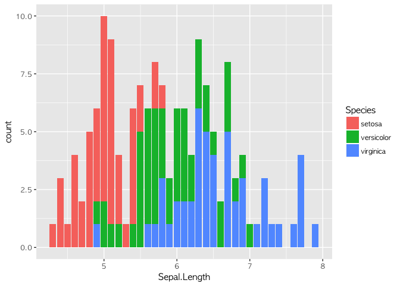
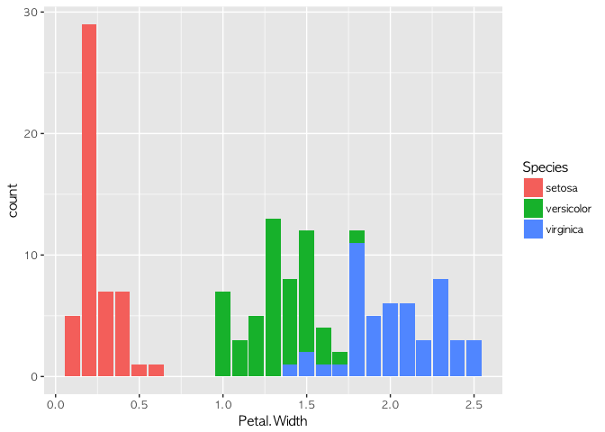
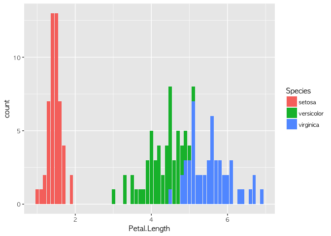

수업개요
--------

사회학과에서 개설한 데이터분석 수업(1학기 데이터분석기법과실습, 2학기 최신사회분석기법과실습)은 사회에서 만들어지는 데이터를 읽고(read), 전처리하여(preprocessing), 시각화 시키고(visualizing), 분석하는(analyzing) 방법을 배운다.

1학기에는 R을 활용한 통계분석에 초점을 맞추고, 2학기에는 다양한 최신의 분석기법(textmining, 사회관계망 분석, 시계열 분석 등)을 배운다.

본 수업을 위해 R을 배운다. 이 교재 또한, R의 패키지인 knitR을 활용하여 RMarkdown을 통해 작성한 것이다.

수업진행 방식
-------------

이 수업은 이론적으로는 50% 이론, 50% 실습으로 진행한다. 단, 실질적으로는 100% 실습으로 느껴질 것이다.

-   이론: 교수가 개념을 설명하고 라이브 코딩을 통해서 내용을 전달하면, 학생들은 이를 따라서 코딩하면서 실행여부를 확인한다.
-   실습: 교수가 예제문제를 제시하면 이를 2~3명 조를 통해서 풀이한다.

수업평가
--------

-   중간/기말고사 : 각 15점(총 30점)
-   퀴즈(총 5회) : 각 5점 (총 25점)
-   개인 과제 : 25점
-   보너스 점수 : 10점
-   출석 : 10점

### A를 받기 위한 방법

1.  수업에 빠지지 않는다.

-   결석 점수는 크게 의미 없지만, 수업에서 빠진 것을 수습하려면 시간이 2배로 걸린다.
-   수업에 빠진 경우 교재를 보고 풀어보고, 안 되는 내용을 교수에게 메일로 물어보거나 상담을 신청한다.

1.  수업에 늦지 않는다.

-   지각 점수도 크게 의미 없지만, 늦으면 그 만큼 타이핑 해야 하는 양이 늘어난다.
-   수업에 지각한 경우, 수업 반장에게 물어보고, 그래도 안 되면 교수에게 메일로 물어보거나 상담을 신청한다.

1.  보너스 점수를 타자

-   퀴즈나 중간고사/기말고사에는 보너스 문제가 있다. (배점과 별개)
-   그 외에도 개인 과제시 교수의 질문에 대답을 잘 하거나, 준비 과정을 성실하게 할 경우 보너스 점수를 준다.

### 통계(?), 통계(!)

사회조사방법론, 사회조사통계론 수업을 수강하면서 수강생들이 겪게되는 가장 큰 어려움은 통계학이다. 1학기에는 방법론 수업에서 배웠던 내용들을 R프로그래밍을 통해 좀 더 쉽게 해결하는 과정을 통해서 통계학을 단련한다.

### R을 배우는 이유

통계를 배우기 위해 가장 쉬운 도구는 엑셀이다. 그러나 수업에서는 엑셀을 R에서 진행한 작업을 확인하는 수준으로 최소한만 배운다. 그 이유는 엑셀의 주요함수가 R에 모두 구현되어 있고, R이 엑셀과 병행하여 사용하는 워드보다도 더 효과적인 문서를 만들 수 있기 때문이다. (이 교재도 RMarkdown을 통해서 제작했다.)

### 데이터 분석, 무엇을 하는가?

사례를 통해 데이터 분석을 어떻게 진행하고 그 결과를 어떻게 해석하는지 간략하게 살핀다. 물론 지금은 연습 시간이므로 실제로 코딩을 진행하지는 않는다.

#### 데이터 과학자가 하는 일 1 - 분류(classification)

야구를 보면 장타형, 출루형, 주루형 등의 속성을 가진 타자들이 있다. 이런 분류는 어떤 데이터를 통해서 확인할 수 있을까? 장타율, 출루율, 도루성공률 등을 통해서 확인할 수 있을 것이다. 이런 식으로 어떤 기준(분류)을 가지고 데이터를 검증하는 방식을 분류 알고리즘이라고 한다.

##### 간단한 분류의 예시

아이리스라는 데이터를 활용해 보겠다. 아이리스 데이터는 통계학자인 피셔Fisher가 소개한 데이터로, 붓꽃의 3가지 종(setosa, versicolor, virginica)에 대해 꽃받침(sepal)과 꽃잎(petal)의 길이를 정리한 데이터다.

    ## # A tibble: 3 x 2
    ##   Species    Sepal.Length
    ##   <fct>             <dbl>
    ## 1 setosa             5.01
    ## 2 versicolor         5.94
    ## 3 virginica          6.59

이렇게 데이터의 내용을 평가하는 작업을 EDA(Exploratory Data Anaylsis)라고 한다. Sepal.Length, Petal.Length, Petal.Width의 분포를 살피면 분류할 수 있는 아이디어를 얻을 수 있다. 실제로 이를 검증해 보기 위해 의사결정트리(Decision Tree)를 만들어 볼 수 있다.

    ##             
    ##              setosa versicolor virginica
    ##   setosa         50          0         0
    ##   versicolor      0         49         5
    ##   virginica       0          1        45

    ##             
    ##              setosa versicolor virginica
    ##   setosa         23          0         0
    ##   versicolor      0         26         3
    ##   virginica       0          1        27

위의 코드를 통해서, 붓꽃의 종류는 Petal Length가 1.9보다 작거나 같을 경우 setosa일 확률이 높고, 그렇지 않을 경우 Petal Width가 1.7보다 작거나 같으면 versicolor, Petal Width가 1.7보다 클 경우 virginica임을 알 수 있다.

#### 데이터 과학자가 하는 일 2: 이상징후 포착

두 사람의 사례를 들어보자. 사린이는 월 200만원을 벌어, 카드값으로 매월 100만원을 내고, 50만원을 저축하고, 나머지는 현금으로 소비한다. 어느 날 카드값이 1000만원이 나왔다. 이건 이상징후일까 아닐까? 경묵이는 월 300만원을 벌어, 보통 카드값으로 270만원을 내고, 30만원을 현금으로 쓴다. 저축은 하지 않는다. 그런데 어느 날 카드값이 100만원 나왔다. 이건 이상징후일까 아닐까?

이런 문제는 개인들에게는 금융 사기, 쉽게 말해 보이스 피싱을 당하느냐 마냐의 문제에 속한다. 사린이는 평소 100만원 카드값을 냈는데, 특별한 이유가 없이 1000만원이 나왔다면, 분명 보이스피싱을 당했거나 큰 사고가 났거나 질병에 걸렸을 것이기 때문이다. 그런데 그게 아니라 1200만원으로 소득이 올라(**그럴 리는 별로 없지만**) 기분을 냈다면, 이는 또 다른 문제가 될 것이다. 경묵이가 100만원만 카드값이 나온 것은 어떻게 해석해야 할까? 아마 좋은 일일 것이다. 재무관리를 통해서 현금 소비를 늘였을 수도 있다. 그러나 소득이 갑자기 줄어들어서 카드값을 줄였다면?

똑같은 고민을 신용카드 회사도 할 것이다. 사린이의 결제액이 늘어났을 때 신용카드 회사는 사린이에게 돈을 더 쓰라고 쿠폰을 줘야 할까? 아니면 신용정보회사에 사린이의 금융사고 신고 내역을 조회해야 할까? 경묵이에게도 할인 쿠폰을 줘서 다시 카드를 쓰게 해야 할까, 아니면 소득이 줄어들었다는 것으로 간주해 혜택을 회수해야 할까?

이런 결정을 하는 것들이 모두 데이터 분석의 이상징후 포착 알고리즘을 통해서 벌어지는 일이다.

    ## $anoms
    ##               timestamp    anoms
    ## 1   1980-09-25 16:05:00  21.3510
    ## 2   1980-09-29 06:40:00 193.1036
    ## 3   1980-09-29 21:44:00 148.1740
    ## 4   1980-09-30 17:46:00  52.7478
    ## 5   1980-09-30 17:48:00  49.6582
    ## 6   1980-09-30 17:50:00  35.6067
    ## 7   1980-09-30 17:51:00  32.5045
    ## 8   1980-09-30 17:52:00  30.0555
    ## 9   1980-09-30 17:53:00  31.2614
    ## 10  1980-09-30 17:54:00  30.2551
    ## 11  1980-09-30 17:55:00  27.3860
    ## 12  1980-09-30 17:56:00  28.9807
    ## 13  1980-09-30 17:57:00  29.0844
    ## 14  1980-09-30 17:58:00  26.9185
    ## 15  1980-09-30 17:59:00  26.4621
    ## 16  1980-09-30 18:00:00  27.2180
    ## 17  1980-09-30 18:01:00  40.4268
    ## 18  1980-09-30 18:02:00  28.8811
    ## 19  1980-09-30 18:03:00  27.1294
    ## 20  1980-09-30 18:04:00  26.9913
    ## 21  1980-09-30 18:05:00  26.7741
    ## 22  1980-09-30 18:06:00  30.6972
    ## 23  1980-09-30 18:07:00  27.6085
    ## 24  1980-09-30 18:08:00  25.2841
    ## 25  1980-09-30 18:09:00  25.2264
    ## 26  1980-09-30 18:10:00  25.1927
    ## 27  1980-09-30 18:11:00  27.6501
    ## 28  1980-09-30 18:12:00  24.8858
    ## 29  1980-09-30 18:13:00  24.8099
    ## 30  1980-09-30 18:14:00  24.2950
    ## 31  1980-09-30 18:15:00  24.5221
    ## 32  1980-09-30 18:16:00  26.7354
    ## 33  1980-09-30 18:17:00  24.7589
    ## 34  1980-09-30 18:18:00  25.6300
    ## 35  1980-09-30 18:19:00  24.6949
    ## 36  1980-09-30 18:20:00  23.6518
    ## 37  1980-09-30 18:21:00  27.6977
    ## 38  1980-09-30 18:22:00  25.8687
    ## 39  1980-09-30 18:23:00  24.6654
    ## 40  1980-09-30 18:24:00  24.6694
    ## 41  1980-09-30 18:25:00  24.4351
    ## 42  1980-09-30 18:26:00  25.7723
    ## 43  1980-09-30 18:27:00  24.2502
    ## 44  1980-09-30 18:28:00  25.0965
    ## 45  1980-09-30 18:29:00  23.9362
    ## 46  1980-09-30 18:30:00  24.4127
    ## 47  1980-09-30 18:31:00  32.8182
    ## 48  1980-09-30 18:32:00  27.4586
    ## 49  1980-09-30 18:33:00  26.3163
    ## 50  1980-09-30 18:34:00  30.3965
    ## 51  1980-09-30 18:35:00  26.9516
    ## 52  1980-09-30 18:36:00  26.8908
    ## 53  1980-09-30 18:37:00  28.9461
    ## 54  1980-09-30 18:38:00  28.9742
    ## 55  1980-09-30 18:39:00  30.0406
    ## 56  1980-09-30 18:40:00  28.8507
    ## 57  1980-09-30 18:41:00  32.7811
    ## 58  1980-09-30 18:42:00  27.7468
    ## 59  1980-09-30 18:43:00  30.8174
    ## 60  1980-09-30 18:44:00  28.5658
    ## 61  1980-09-30 18:45:00  27.6677
    ## 62  1980-09-30 18:46:00  31.0409
    ## 63  1980-09-30 20:16:00 154.7750
    ## 64  1980-09-30 20:17:00 148.8620
    ## 65  1980-09-30 20:23:00 165.7870
    ## 66  1980-09-30 20:24:00 167.5850
    ## 67  1980-09-30 20:25:00 170.3490
    ## 68  1980-09-30 20:26:00 180.8990
    ## 69  1980-09-30 20:27:00 170.5130
    ## 70  1980-09-30 20:28:00 174.6780
    ## 71  1980-09-30 20:29:00 164.7350
    ## 72  1980-09-30 20:30:00 178.8220
    ## 73  1980-09-30 20:31:00 198.3260
    ## 74  1980-09-30 20:32:00 203.9010
    ## 75  1980-09-30 20:33:00 200.3090
    ## 76  1980-09-30 20:34:00 178.4910
    ## 77  1980-09-30 20:35:00 167.7480
    ## 78  1980-09-30 20:36:00 183.0180
    ## 79  1980-09-30 20:37:00 176.7690
    ## 80  1980-09-30 20:38:00 186.8230
    ## 81  1980-09-30 20:39:00 183.6600
    ## 82  1980-09-30 20:40:00 179.2760
    ## 83  1980-09-30 20:41:00 197.2830
    ## 84  1980-09-30 20:42:00 191.0970
    ## 85  1980-09-30 20:43:00 194.6700
    ## 86  1980-09-30 20:44:00 177.3250
    ## 87  1980-09-30 20:45:00 173.7580
    ## 88  1980-09-30 20:46:00 200.8160
    ## 89  1980-09-30 20:47:00 186.2350
    ## 90  1980-09-30 20:48:00 185.4210
    ## 91  1980-09-30 20:49:00 178.9580
    ## 92  1980-09-30 20:50:00 171.7500
    ## 93  1980-09-30 20:51:00 203.2310
    ## 94  1980-09-30 20:52:00 181.3540
    ## 95  1980-09-30 20:53:00 186.7780
    ## 96  1980-09-30 20:54:00 175.5820
    ## 97  1980-09-30 20:55:00 176.1250
    ## 98  1980-09-30 20:56:00 181.5140
    ## 99  1980-09-30 20:57:00 175.2610
    ## 100 1980-09-30 20:58:00 164.7190
    ## 101 1980-09-30 21:01:00 170.7360
    ## 102 1980-09-30 21:02:00 151.5490
    ## 103 1980-09-30 21:03:00 149.4120
    ## 104 1980-09-30 21:04:00 150.5540
    ## 105 1980-09-30 21:06:00 149.5410
    ## 106 1980-10-02 23:20:00 188.2908
    ## 107 1980-10-05 01:12:00  56.4691
    ## 108 1980-10-05 01:13:00  54.9415
    ## 109 1980-10-05 01:14:00  52.0359
    ## 110 1980-10-05 01:15:00  47.7313
    ## 111 1980-10-05 01:16:00  50.5876
    ## 112 1980-10-05 01:17:00  48.2846
    ## 113 1980-10-05 01:18:00  44.6438
    ## 114 1980-10-05 01:19:00  42.3077
    ## 115 1980-10-05 01:20:00  38.8363
    ## 116 1980-10-05 01:21:00  41.0145
    ## 117 1980-10-05 01:22:00  39.5523
    ## 118 1980-10-05 01:23:00  38.9117
    ## 119 1980-10-05 01:24:00  37.3052
    ## 120 1980-10-05 01:25:00  36.1725
    ## 121 1980-10-05 01:26:00  37.5150
    ## 122 1980-10-05 01:27:00  38.1387
    ## 123 1980-10-05 01:28:00  39.5351
    ## 124 1980-10-05 01:29:00  38.1834
    ## 125 1980-10-05 01:30:00  37.5988
    ## 126 1980-10-05 01:31:00  43.6522
    ## 127 1980-10-05 01:32:00  47.9571
    ## 128 1980-10-05 13:08:00 210.0000
    ## 129 1980-10-05 13:18:00  40.0000
    ## 130 1980-10-05 13:28:00 250.0000
    ## 131 1980-10-05 13:38:00  40.0000
    ## 
    ## $plot

이러한 그래프를 통해 특이한 지점(9월 30일 저녁)을 포착하고, 이에 따른 진단을 할 수 있는 것이다.

#### 데이터 과학자가 하는 일 3 - 회귀 분석

매년 7월의 평균 날씨가 섭씨 24도였다고 가정하자. "7월 22일의 날씨는 몇도일까?" TV 광고를 몇 번 하면, 갤럭시 노트는 한 대를 팔 수 있을까?

이런 질문에 대한 답변이 회귀분석을 통해 도출될 수 있다.

    ## 
    ## Call:
    ## lm(formula = sales ~ TV, data = train)
    ## 
    ## Residuals:
    ##     Min      1Q  Median      3Q     Max 
    ## -8.5816 -1.7845 -0.2533  2.1715  6.9345 
    ## 
    ## Coefficients:
    ##             Estimate Std. Error t value Pr(>|t|)    
    ## (Intercept) 6.764098   0.607592   11.13   <2e-16 ***
    ## TV          0.050284   0.003463   14.52   <2e-16 ***
    ## ---
    ## Signif. codes:  0 '***' 0.001 '**' 0.01 '*' 0.05 '.' 0.1 ' ' 1
    ## 
    ## Residual standard error: 3.204 on 120 degrees of freedom
    ## Multiple R-squared:  0.6373, Adjusted R-squared:  0.6342 
    ## F-statistic: 210.8 on 1 and 120 DF,  p-value: < 2.2e-16

    ##          term   estimate std.error statistic      p.value
    ## 1 (Intercept) 6.76409784 0.6075916  11.13264 3.307215e-20
    ## 2          TV 0.05028368 0.0034632  14.51943 3.413075e-28

회귀분석을 통해 tv광고를 한 번 하면 스마트폰 0.05대를 팔 수 있다는 결과가 나온다. 즉 1대를 팔기 위해서는 TV광고가 20번 이상 노출되어야 가능하다는 것이다. 그리고 p-value를 통해서 그런 검증이 얼마나 맞는지를 확인할 수 있다. training set과 test set을 활용하면, 그 사례를 가지고 다른 사례에도 적용가능한지를 시뮬레이션 해볼 수 있다.

사회조사통계를 공부하면서 가장 어려운 것이 t-value, p-value, F statistics의 점수를 구해서 그 의미를 해석하는 것이었으리라. 하지만 R Programming을 통해서는 좀 더 직관적으로 이러한 내용의 의미를 해석할 수 있다. 아래의 그래프를 보자.

    ## 
    ## Call:
    ## lm(formula = sales ~ TV + radio + newspaper, data = train)
    ## 
    ## Residuals:
    ##     Min      1Q  Median      3Q     Max 
    ## -4.8426 -0.6466  0.2165  1.0640  2.6804 
    ## 
    ## Coefficients:
    ##              Estimate Std. Error t value Pr(>|t|)    
    ## (Intercept)  2.822206   0.369369   7.641 6.29e-12 ***
    ## TV           0.047362   0.001657  28.577  < 2e-16 ***
    ## radio        0.196375   0.010347  18.979  < 2e-16 ***
    ## newspaper   -0.010593   0.006460  -1.640    0.104    
    ## ---
    ## Signif. codes:  0 '***' 0.001 '**' 0.01 '*' 0.05 '.' 0.1 ' ' 1
    ## 
    ## Residual standard error: 1.527 on 118 degrees of freedom
    ## Multiple R-squared:  0.9189, Adjusted R-squared:  0.9169 
    ## F-statistic: 445.9 on 3 and 118 DF,  p-value: < 2.2e-16

    ##          term    estimate   std.error statistic      p.value
    ## 1 (Intercept)  2.82220600 0.369369200   7.64061 6.292503e-12
    ## 2          TV  0.04736209 0.001657356  28.57690 7.360519e-55
    ## 3       radio  0.19637507 0.010346756  18.97939 1.171088e-37
    ## 4   newspaper -0.01059255 0.006460332  -1.63963 1.037455e-01

    ## $model1
    ##   r.squared adj.r.squared    sigma statistic      p.value df    logLik
    ## 1 0.6372581     0.6342353 3.204129  210.8137 3.413075e-28  2 -314.1639
    ##        AIC      BIC deviance df.residual
    ## 1 634.3279 642.7399 1231.973         120
    ## 
    ## $model2
    ##   r.squared adj.r.squared    sigma statistic      p.value df    logLik
    ## 1 0.9189394     0.9168785 1.527446  445.9001 3.486405e-64  4 -222.7558
    ##        AIC      BIC deviance df.residual
    ## 1 455.5116 469.5317 275.3046         118

TV 광고만 했을 때와, 라디오, 신문광고를 포함했을 때의 효과를 함께 비교해 볼 수도 있다. 회귀분석은 즉, 이렇게 다양한 변수를 통해서 우리가 원하는 예측을 도출할 수 있는 방법이다.

#### 데이터 과학자가 하는 일 4 - 클러스터링

여러분이 이마트 매장 담당자라고 생각해보자. 면도기는 어디에 배치하면 될까? 여기에는 사회학적 상상력이 필요하다. 그러나 본인의 상상력만으로 문제를 풀 수 있는 것은 아니다.

면도기와 기저귀, 면도기와 맥주. 이 중 어떤 것이 더 면도기 매출을 늘릴 수 있을까? 성별 분포나 동네의 특성에 대한 사회학적인 분석이 필요하다. 만약 30대 부부가 많이 사는 동네라면? 면도기는 기저귀에서 멀어지면 안 된다. 만약 20대 대학생이 많이 사는 동네라면? 면도기는 당연히 맥주와 멀지 않은 곳에 있어야 한다. 자취생의 필수품인 과자, 육포 등의 안주도 멀지 않은 곳에 있는 것이 유리할 것이다.

이러한 방식으로 분류가 정의되지 않은(unsupervised) 데이터를 통해 그룹을 추정하는 것을 클러스터링이라고 한다. 클러스터링을 통해 20대 대학생의 소비, 30대 남성의 소비 등에 대한 기준을 파악할 수 있다. 클러스터링은 데이터를 통해 사고하는 마케팅 담당자의 필수적인 기술이라고 할 수 있다. 아래의 예시는 영국 소설 몇 권을 무작위로 뽑아, 책의 단어들을 통해 어떤 소설인지를 추정하는 코드다.

    ## <<DocumentTermMatrix (documents: 2246, terms: 10473)>>
    ## Non-/sparse entries: 302031/23220327
    ## Sparsity           : 99%
    ## Maximal term length: 18
    ## Weighting          : term frequency (tf)

4권의 책이 나오고, 실제로 그 추정이 제대로 맞아 떨어짐을 확인할 수 있다.

#### 데이터 과학자가 하는 일 5 - 증강학습

앞에서 배운 4가지의 일. 즉, 분류, 이상징후 포착, 회귀, 클러스터링을 통해 무엇을 할 것인가? 그 최종적인 결론이 증강학습 알고리즘이다. 패턴 몇 가지가 보였을 때 최종적으로 다음 액션이 무엇이 좋을지를 추정하는 것은 알파고가 이세돌의 수를 보고 바둑에 기보하는 것과 같은 방식이다. 증강학습 알고리즘은 '끝판왕'이다.

수업에서 다룰 것들
------------------

이쯤에서 겁을 먹을 수 있을 것이다. "저는 수포자.. 문송합니다.."

그러나 겁먹을 필요는 없다. 책에서는 5가지 중 4(분류, 이상징후 포착, 회귀, 클러스터링)가지를 간단하게 배우고, 2가지(분류, 회귀)에 집중할 것이다. 좀 더 긴 시간 동안 여러분이 배우게 될 것은 데이터의 입력과 출력, 전처리, 간단한 시각화, 추론 통계 검증(t-검정, 선형회귀)과 재미있는 프로그래밍이다.

### 앞으로의 진도

중간고사 전까지의 배울 범위(5장까지)는 다음과 같다. 2장: R/RStudio 프로그램 설치와 기본 활용법(단축키, 기초 연산) 3장: 엑셀 익히기(vlookup, 데이터 패키지 익히기) 4장: R프로그래밍 기초(1): 숫자 연산, 변수 지정, 데이터 구조, 함수형 프로그래밍(for-loop / map) 5장: R프로그래밍 기초(2): tidy 문법 익히기

그 이상이 궁금한 학생들이 있을까봐 나중의 진도도 공개는 한다. 하지만 지금 그걸 생각할 필요는 전혀 없다.
