안내
----

이번 장에서는 데이터 시각화를 배운다. 앞서서는 데이터 프레임을 통해서 데이터를 가공(wrangling) 하는 방법을 배웠다. 그러나 데이터를 가공해서 수치로 보는 것은 분석가에게는 편한 일이나, 세상 대부분의 사람들은 수치보다는 그래프 같이 시각저으로 잘 보이는 것을 선호한다.

R의 패키지인 ggplot2는 앞서 언급했던 Hadley Wickham이 만든 시각화 명령어들을 담고 있다. 엑셀이나 다른 프로그래밍 언어인 python보다 훨씬 훌륭한 그래픽을 자랑하며, 조금만 노력하면 풍성한 내용을 화면으로 출력해 보고서나 논문, 홍보물 등에 쓸 수 있다.

준비
----

데이터 시각화를 위해서 특별히 준비할 것은 없다. 다만 dplyr과 ggplot2를 활용할 수 있는 tidyverse 패키지만 로드하면 된다.

``` r
library(tidyverse)
```

    ## ── Attaching packages ──────────────────────────────────────────────────────────────── tidyverse 1.2.1 ──

    ## ✔ ggplot2 2.2.1     ✔ purrr   0.2.4
    ## ✔ tibble  1.4.2     ✔ dplyr   0.7.4
    ## ✔ tidyr   0.8.0     ✔ stringr 1.2.0
    ## ✔ readr   1.1.1     ✔ forcats 0.2.0

    ## ── Conflicts ─────────────────────────────────────────────────────────────────── tidyverse_conflicts() ──
    ## ✖ dplyr::filter() masks stats::filter()
    ## ✖ dplyr::lag()    masks stats::lag()

ggplot의 기본 문법
------------------

ggplot은 다음과 같은 구조로 생긴 명령어다. 기존의 명령어와 형태가 다르니 눈여겨 볼 필요가 있다. 단 pipe ( %&gt;% ) 대신 "+"를 사용한다고 생각하면 편하다.

-   방식 1: ggplot(data = DF, mapping = aes(x = var1, y = var2, color = var3, fill = var4)) + geom\_point()
-   방식 2: ggplot(data = DF) + geom\_point(aes(x = var1, y = var2, color = var1, fill = var2))

-   ggplot 명령어는 좌표를 잡아주고, geom\_point/geom\_bar/geom\_col/geom\_line 같이 "+" 연산 뒤에 나오는 명령어들은 좌표 안에 그림을 그려준다. 점(point)/막대(bar/col)/선(line)이 기본적인 ggplot의 보조 명령어다.

**DF**는 데이터 프레임을 의미한다. var1은 x축의 변수, var2는 y축의 변수, var3는 색깔을 변화시키기 위해 필요한 변수, var4도 색깔(도형을 색칠)을 변화시키기 위해 필요한 변수다.

-   aes 안에는 변수가 들어간다. 변수가 아니라 상수(지정된 값)을 집어넣으면 그래프가 망가진다.

-   색깔 지정(color)을 aes 바깥에 넣을 수 있다. 그럴 경우에는 상수를 집어넣는다. 그러면 정해진 색깔이 나온다. 예: ggplot(DF, aes(x, y)) + geom\_bar(color = "red")

-   **data**, **mapping** 같은 단어는 생략해도 괜찮다.

### 큰 엔진과 작은 엔진 중 어떤 게 연료를 더 많이 먹을까? (점 그래프 그리기)

기본 문법은 생각이 안 날 때마다 보면서 익히도록 하고, 실전을 통해서 그래프를 그려보자.

이미 여러분은 큰 엔진을 쓰는 차가 연료를 더 쓸 거라고 답을 갖고 있을 것이다. 실제 사례를 통해서 살펴보자. 엔진 크기와 연비의 관계는 어떨까? 양의 상관관계일까, 아니면 음의 상관관계일까? 선형일까? 비선형일까? (뒤의 두 질문은 생략해도 되겠다.)

#### mpg 데이터를 통한 점 그래프(scatterplot) 그리기

mpg 데이터셋은 tidyverse 패키지를 설치하면 그 안에 있기 때문에 data() 명령을 통해서 불러오기만 하면 된다.

``` r
data(mpg)
glimpse(mpg)
```

    ## Observations: 234
    ## Variables: 11
    ## $ manufacturer <chr> "audi", "audi", "audi", "audi", "audi", "audi", "...
    ## $ model        <chr> "a4", "a4", "a4", "a4", "a4", "a4", "a4", "a4 qua...
    ## $ displ        <dbl> 1.8, 1.8, 2.0, 2.0, 2.8, 2.8, 3.1, 1.8, 1.8, 2.0,...
    ## $ year         <int> 1999, 1999, 2008, 2008, 1999, 1999, 2008, 1999, 1...
    ## $ cyl          <int> 4, 4, 4, 4, 6, 6, 6, 4, 4, 4, 4, 6, 6, 6, 6, 6, 6...
    ## $ trans        <chr> "auto(l5)", "manual(m5)", "manual(m6)", "auto(av)...
    ## $ drv          <chr> "f", "f", "f", "f", "f", "f", "f", "4", "4", "4",...
    ## $ cty          <int> 18, 21, 20, 21, 16, 18, 18, 18, 16, 20, 19, 15, 1...
    ## $ hwy          <int> 29, 29, 31, 30, 26, 26, 27, 26, 25, 28, 27, 25, 2...
    ## $ fl           <chr> "p", "p", "p", "p", "p", "p", "p", "p", "p", "p",...
    ## $ class        <chr> "compact", "compact", "compact", "compact", "comp...

일단 배기량(displ)과 고속도로연비(hwy)의 관계를 산포도로 그려보자. 이를 위해서 필요한 명령어는 ggplot2 패키지의 핵심 명령어인 ggplot, 그리고 scatter plot을 그리기 위해 필요한 보조 문법인 geom\_point()이다.

``` r
ggplot(data = mpg) + 
  geom_point(mapping = aes(x = displ, y = hwy))
```

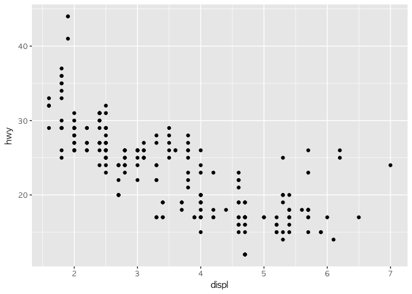

여러분의 첫번째 그래프이다. 우측 하단의 'Plots' 버튼을 누르고 창을 보면 그래프를 확인할 수 있다.

그림를 보면 displ 변수와 hwy 변수 간에 음의 상관관계가 느슨하게 나오는 걸 확인할 수 있다. 다른 말로 하자면 큰 엔진을 단 차는 기름을 더 먹는다. 그럼 이걸로 엔진 크기와 연비에 대한 우리의 생각을 입증할 수 있을까?

#### 연습문제

1.  ggplot(mpg) 만 쳐보자. 무엇이 나오는가?
2.  mtcars 데이터를 활용하여 mpg와 wt 변수간의 점 그래프를 그려보자.
3.  mpg 데이터의 변수를 바꿔 hwy를 x축으로, cyl을 y축으로 해서 점 그래프를 그려보자.

#### 변수 특성으로 색깔과 크기, 모양 조정하기 color / size / alpha / shape 등

앞서서 aes() 안의 color나 fill을 활용하면 색깔을 넣을 수 있다고 했다. 다른 변수를 지정하면 색깔의 분포를 통해 데이터의 분포를 추정해 볼 수 있다. 시도해보자.

``` r
ggplot(data = mpg) + 
  geom_point(mapping = aes(x = displ, y = hwy, color = class))
```


범주를 나타내는 class의 속성에 따라 색깔이 다르게 나타나는 것을 확인할 수 있다. 보니까 2인승 차들만 엔진이 커도 연비가 좋은 걸로 나온다. 이 전의 코드와 달라진 건 color 변수를 추가한 것이다. color에 분류 하고 싶은 변수를 집어 넣으면 그 타입에 따라서 색깔이 다르게 나온다.

조금 더 잘 확인할 수 있는 방법은 없을까? 이번엔 크기를 통해 분류해 보자.

``` r
ggplot(data = mpg) + 
  geom_point(mapping = aes(x = displ, y = hwy, size = class))
```

    ## Warning: Using size for a discrete variable is not advised.

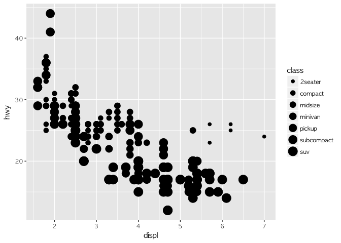

이번에는 class를 통해 점의 크기를 조정해 봤다. 그러나 좋은 분류는 아닌 것 같다. 좀 다른 방식(alpha나 shape)을 활용해 볼 수도 있다.

``` r
ggplot(data = mpg) + 
  geom_point(mapping = aes(x = displ, y = hwy, alpha = class))
```


``` r
ggplot(data = mpg) + 
  geom_point(mapping = aes(x = displ, y = hwy, shape = class))
```

    ## Warning: The shape palette can deal with a maximum of 6 discrete values
    ## because more than 6 becomes difficult to discriminate; you have 7.
    ## Consider specifying shapes manually if you must have them.

    ## Warning: Removed 62 rows containing missing values (geom_point).


그런데, 아까 aes 안에는 변수만 넣을 수 있다고 했다. 만약 그 안에 색깔을 상수로 지정하면 어떻게 될까? 바깥에 빼면 또 어떻게 될까? 비교해 보자.

``` r
ggplot(data = mpg) + 
  geom_point(mapping = aes(x = displ, y = hwy, color = "blue"))
```


``` r
ggplot(data = mpg) + 
  geom_point(mapping = aes(x = displ, y = hwy), color = "blue")
```


위에는 파란색("blue")을 썼으나 선홍색이 나오고, 아래에는 제대로 파란색이 나온다. 그런데 색깔을 쓰는 이유가 변수의 값에 따라 색깔을 바꿔주고 싶다는 것에서 출발한다는 것을 감안하면 별로 흥미로운 결과는 아닐 것이다.

### 추세선 그리기

점 그래프를 보면서 우리는 어렴풋이 값들이 어떤 관계를 갖는지 추정할 수 있다. 하지만 그것만으로는 약하다. 엑셀 학습 시간에 배웠듯이 경향성을 드러내는 추세선이 있다면 조금 더 정밀하게 결과를 예측할 수 있을 것이다. 이를 위해 필요한 명령어가 geom\_smooth()이다.

``` r
ggplot(mpg, aes(x = displ, y = hwy)) + 
  geom_smooth()
```

    ## `geom_smooth()` using method = 'loess'

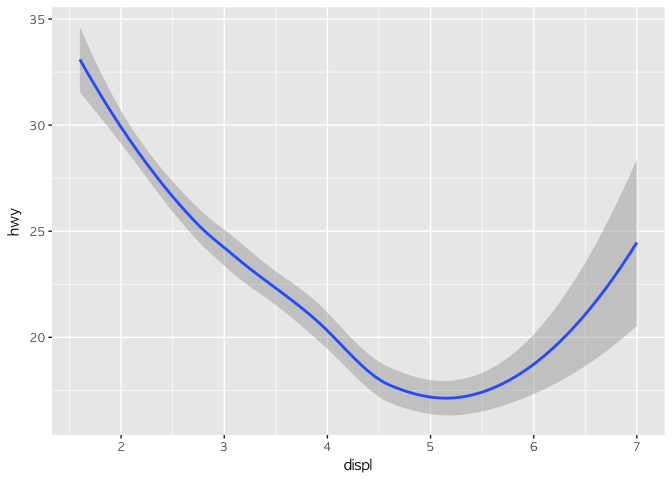

``` r
ggplot(mpg, aes(x = displ, y = hwy)) + 
  geom_smooth(method = "lm")
```

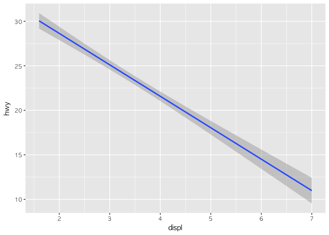

두 개의 그래프를 보자. 먼저 나온 그래프는 곡선형태를 띄고 있고, 나중의 그래프는 직선형태를 띄고 있다. 후자는 엑셀 그래프에서도 봤던 선형회귀선이고, 전자는 loess라는 방식을 통해서 값을 따라다니면서 만든 추세선이다(아무 옵션을 넣지 않으면 자동으로 method = "loess"가 적용된다). 좀 더 명확히 이해하기 위해 원래의 점을 추가해서 그려보자.

``` r
ggplot(mpg, aes(x = displ, y = hwy)) + 
  geom_point() + geom_smooth()
```

    ## `geom_smooth()` using method = 'loess'


``` r
ggplot(mpg, aes(x = displ, y = hwy)) + 
  geom_point() + geom_smooth(method = "lm")
```


drv의 속성에 따라서 분류해 보면 어떨까? color는 해봤으니 이번에는 linetype으로 분류해 보자.

``` r
ggplot(mpg, aes(x = displ, y = hwy)) + 
  geom_point() + geom_smooth(aes(linetype = drv))
```

    ## `geom_smooth()` using method = 'loess'

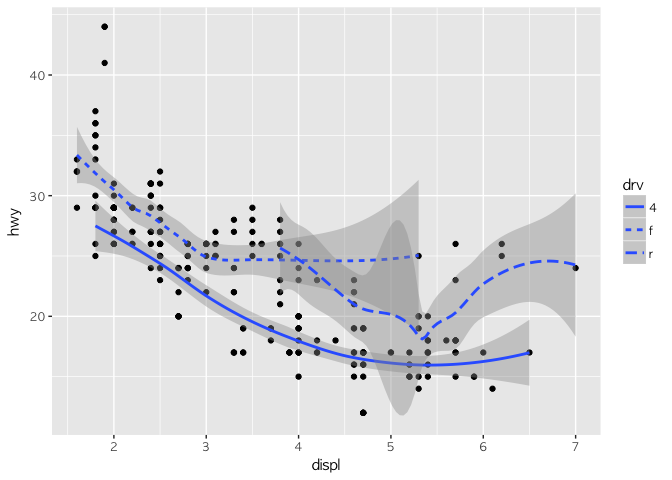

``` r
ggplot(mpg, aes(x = displ, y = hwy)) + 
  geom_point() + geom_smooth(aes(linetype = drv), method = "lm")
```

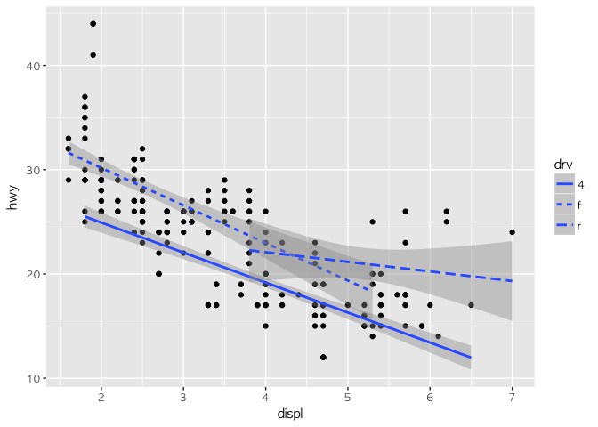

linetype도 그래프를 잘 보여주지만, color가 좀 더 구분하기 쉬운 것 같다. 다시 시도해 보자.

``` r
ggplot(mpg, aes(x = displ, y = hwy, color = drv)) + 
  geom_point() + geom_smooth()
```

    ## `geom_smooth()` using method = 'loess'


이제 좀 drv의 속성에 따른 데이터 분포를 쉽게 파악할 수 있다.

#### 변수를 어디에 넣을까?

눈치가 빠른 학생은 알아챘겠지만, aes를 ggplot에 넣거나 geom\_point에 넣거나 geom\_smooth에 넣는 경우가 있었다. 어떤 차이가 있었을까?

-   ggplot에 넣을 경우 뒤에 따라오는 보조 함수 모두에 적용 된다.
-   geom\_point나 geom\_smooth 등 보조 함수에 aes를 넣을 경우 해당 그래프에만 적용된다.

#### 연습 문제

-   x = displ, y = hwy로 하여 class 따라 색깔이 변하는 점 그래프를 그리고 smooth는 전체에 해당되는 추세선이 나오게 하는 그래프를 그려 보시오.
-   x = displ, y = hwy로 하며 drv에 따라 색깔이 변하는 점 그래프를 그리고 smooth도 drv에 따라서 다르게 나타나게 하는 그래프를 그려 보시오.
-   se = FALSE를 geom\_smooth()에 추가해 보자. 어떤 차이가 있는가?

#### 뭉게짐의 회피: jitter

많은 양의 행(관측값)이 있는 데이터로 그래프를 그리다보면, 점들이 떡질 때가 있다. 뭉친다는 말이다. 그럴 때 해결법으로 geom\_jitter()를 활용한다. 다음과 같이 사용한다.

``` r
ggplot(mpg, aes(x = displ, y = hwy)) + 
  geom_point() + geom_jitter()
```

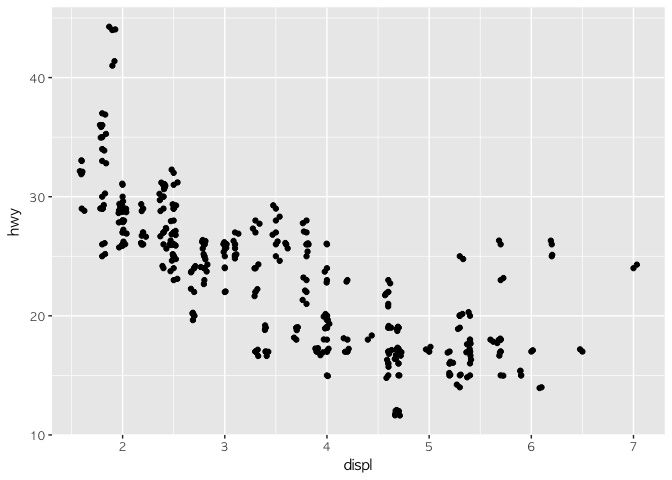

``` r
ggplot(mpg, aes(x = displ, y = hwy)) +
  geom_point(position = "jitter")
```

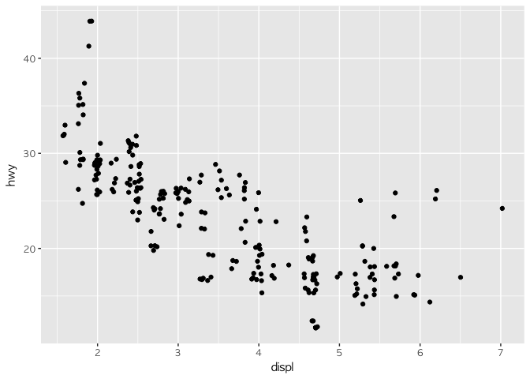

그냥 geom\_point에 position = "jitter"를 추가해줘도 결과는 같다. jitter를 사용하면, 점들에 난수를 삽입해 근처로 흩어지게 해서 구분을 쉽게 하는 장점이 있다. 생각날 때 써보도록 하자.

### 다이아몬드 데이터를 활용한 막대 그래프 그리기

#### 히스토그램 그리기

엑셀 데이터 활용에서도 봤지만, 히스토그램은 계급구간마다 '몇 개'가 있는지를 확인해 주는 통계값이다. ggplot2를 이용해서도 히스토그램을 쉽게 그릴 수 있다. 따라해 보자.

``` r
ggplot(diamonds) + 
  geom_bar(aes(x = cut))
```

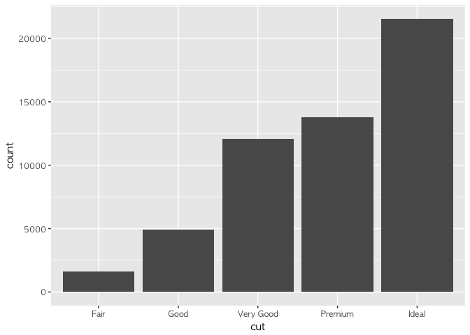

다이아몬드 세공수준에 따라 몇 개씩이 있는지를 쉽게 파악할 수 있다. 여기에 색깔을 넣고 싶다면, aes() 안에 fill = cut을 넣어주면 된다.

``` r
ggplot(diamonds) + 
  geom_bar(aes(x = cut, fill = cut))
```


조금 더 보기 좋아졌다. 막대그래프를 그리는 geom\_bar는 특별하게 변수를 지정하지 않으면 y 축에서 숫자를 센다. 즉 몇 개씩이 있는 지를 세는 것이다. 그리고 자동으로 모양을 적정한 수준에서 맞춰서 시각적으로 분포 시키는 것이다. 원리는 다음과 같다. (영어라도 눈으로 보면 된다.)


이러한 숫자를 세는 함수로 stat\_count()라는 것도 있다. 즉 geom\_bar()를 쓰는 것 대신 stat\_count()를 써도 마찬가지 결과가 나온다.

``` r
ggplot(data = diamonds) + 
  stat_count(mapping = aes(x = cut, fill = cut))
```


만약 세공 수준에 따른 빈도(1을 전체로 볼 때 0.1, 0.2 식으로..)로 보려면 어떻게 하면 될까? y 변수를 "..prop.."으로 지정하면 된다.

``` r
ggplot(data = diamonds) + 
  geom_bar(mapping = aes(x = cut, y = ..prop.., group = 1))
```


#### histogram의 변형.

잠시 diamonds 데이터를 뜯어보자. color나 clarity 같은 변수를 기준으로 히스토그램 안의 세밀한 분포를 보고 싶다, 그러면 어떻게 하면 될까?

``` r
ggplot(diamonds) + 
  geom_bar(aes(x = cut, fill = clarity))
```

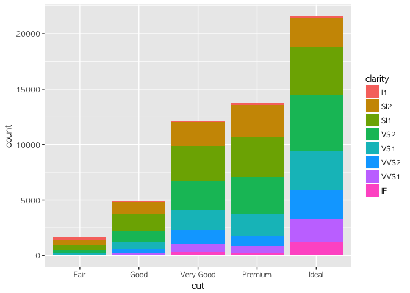

``` r
ggplot(diamonds) + 
  geom_bar(aes(x = cut, fill = clarity), position = "fill")
```


``` r
ggplot(diamonds) + 
  geom_bar(aes(x = cut, fill = clarity), position = "dodge")
```


첫 번째 그래프는 기존 히스토그램의 모양을 그대로 두고 clarity에 따라 그래프를 쪼갠 모양이다. 두 번째는 아예 전체를 100%라고 보고 clarity에 따라 %별로 쪼갠 그래프이다. 세번째는 두 가지를 혼합하여, cut 변수 각각의 상대적인 규모를 고려하여 clarity에 따라 쪼갠 히스토그램 그래프이다. 이런 세 가지 형태를 필요에 따라 유연하게 쓸 수 있게 될 수록 '고수'가 되는 길은 가까워 진다.

#### histogram과 도수분포표

앞서 엑셀을 다룰 때를 상기해 보면, histogram 그래프 옆에는 도수분포표가 있었다. 도수분포표는 어떻게 구현할 수 있을까? 급간별로 몇 개가 있는지를 확인하면 된다는 점을 생각해 보면 dplyr의 기능을 활용하여 쉽게 구현할 수 있다. 다음과 같다.

``` r
diamonds %>% 
  group_by(cut) %>% 
  summarise(count=n())
```

    ## # A tibble: 5 x 2
    ##   cut       count
    ##   <ord>     <int>
    ## 1 Fair       1610
    ## 2 Good       4906
    ## 3 Very Good 12082
    ## 4 Premium   13791
    ## 5 Ideal     21551

``` r
diamonds %>% 
  count(cut)
```

    ## # A tibble: 5 x 2
    ##   cut           n
    ##   <ord>     <int>
    ## 1 Fair       1610
    ## 2 Good       4906
    ## 3 Very Good 12082
    ## 4 Premium   13791
    ## 5 Ideal     21551

group\_by()와 summarise()를 활용해 n()을 붙여서 확인할 수도 있고, count라는 명령어를 통해 확인할 수도 있다. 결과는 같다.

cut이 범주형 변수였다면, carat 같은 연속형 범주로도 히스토그램을 그릴 수 있을까? 가능하다. 아래와 같은 방법을 동원하면 된다.

``` r
diamonds %>% 
  group_by(cut_width(carat, 0.5)) %>% 
  summarise(count = n())
```

    ## # A tibble: 11 x 2
    ##    `cut_width(carat, 0.5)` count
    ##    <fct>                   <int>
    ##  1 [-0.25,0.25]              785
    ##  2 (0.25,0.75]             29498
    ##  3 (0.75,1.25]             15977
    ##  4 (1.25,1.75]              5313
    ##  5 (1.75,2.25]              2002
    ##  6 (2.25,2.75]               322
    ##  7 (2.75,3.25]                32
    ##  8 (3.25,3.75]                 5
    ##  9 (3.75,4.25]                 4
    ## 10 (4.25,4.75]                 1
    ## 11 (4.75,5.25]                 1

``` r
diamonds %>% 
  count(cut_width(carat, 0.5))
```

    ## # A tibble: 11 x 2
    ##    `cut_width(carat, 0.5)`     n
    ##    <fct>                   <int>
    ##  1 [-0.25,0.25]              785
    ##  2 (0.25,0.75]             29498
    ##  3 (0.75,1.25]             15977
    ##  4 (1.25,1.75]              5313
    ##  5 (1.75,2.25]              2002
    ##  6 (2.25,2.75]               322
    ##  7 (2.75,3.25]                32
    ##  8 (3.25,3.75]                 5
    ##  9 (3.75,4.25]                 4
    ## 10 (4.25,4.75]                 1
    ## 11 (4.75,5.25]                 1

cut\_width()는 어떤 변수를 지정된 숫자의 급간으로 쪼개주는 기능을 한다. 히스토그램(Histogram)은 연속형 변수를 일정한 구간(binwidth)으로 나누어서 빈도수를 구한 후에 이를 막대그래프로 그린 그래프인 것이다. 그래프가 전개되면 가장 높은 칸이 3만 개 정도의 관측값을 갖는 것을 확인할 수 있다. 0.25~0.75 구간이 그렇다. 조금 더 정교하게 보기 위해서는 bin\_width 인자를 수정하면 된다. 여러분은 다양한 간격을 조정해서 실제로 어떤 패턴으로 carat 값이 있는지를 확인할 수 있게 된다. 조금 더 정교하게 값을 히스토그램에 표현하려면 이렇게 하면 된다. 3보다 작은 숫자들만 filter 하면 될 것이다.

``` r
smaller <- diamonds %>% 
  filter(carat < 3) # 3 이하의 캐럿 값만 표시
  
ggplot(smaller, aes(x = carat)) +
  geom_histogram(binwidth = 0.1) # 히스토그램 그리기
```


이번에는 geom\_bar 대신 geom\_histogram을 썼다. geom\_histogram은 히스토그램을 그리는 데 특화된 명령어이다. binwidth라는 인자(argument)를 활용해 급간을 잘라줄 수 있기 때문이다. 위에서는 0.1을 기준으로 잘라 봤다.

히스토그램 대신 geom\_freqoly라는 명령어를 쓰면 좀 더 다양한 표현이 가능해진다. 따라해 보자.

``` r
ggplot(smaller, aes(x = carat, colour = cut)) +
  geom_freqpoly(binwidth = 0.1)
```

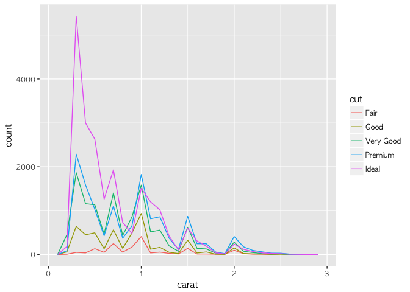

### 선 그래프 그리기

선형 그래프는 시계열 자료를 표현할 때 많이 사용되기 때문에 사용 빈도가 높은 그래프 중 하나다. R에서 작성하는 법을 알아두면 두고두고 요긴하게 사용할 수 있다.

ggplot2에서 선형 그래프를 그릴 때 x축의 변수로는 연속형(numeric, Date 등), 범주형(factor, character 타입) 변수를 모두 사용할 수 있다. 우선 x축이 연속형 변수일 때를 가정하고 선형 그래프를 작성해 보겠다. R에 내장되어 있는 기본 데이터 셋인 airquality를 사용해 보겠다.

airquality 데이터셋은 1973년도에 측정된 뉴욕의 일간 airquality 자료다. 날짜와 날짜별로 다양한 정보를 담은 데이터를 시계열 데이터라고 한다. airquality는 시계열 데이터라고 볼 수 있다. 데이터를 불러놓고 개요를 우선 살펴보자.

``` r
data(airquality)
glimpse(airquality)
```

    ## Observations: 153
    ## Variables: 6
    ## $ Ozone   <int> 41, 36, 12, 18, NA, 28, 23, 19, 8, NA, 7, 16, 11, 14, ...
    ## $ Solar.R <int> 190, 118, 149, 313, NA, NA, 299, 99, 19, 194, NA, 256,...
    ## $ Wind    <dbl> 7.4, 8.0, 12.6, 11.5, 14.3, 14.9, 8.6, 13.8, 20.1, 8.6...
    ## $ Temp    <int> 67, 72, 74, 62, 56, 66, 65, 59, 61, 69, 74, 69, 66, 68...
    ## $ Month   <int> 5, 5, 5, 5, 5, 5, 5, 5, 5, 5, 5, 5, 5, 5, 5, 5, 5, 5, ...
    ## $ Day     <int> 1, 2, 3, 4, 5, 6, 7, 8, 9, 10, 11, 12, 13, 14, 15, 16,...

날짜에 따른 바람 추이를 그려보는 것을 목표로 하자. 무엇부터 해야할까? 우선 Month와 Day를 통합해야 할 것이다. 이를 위해 parse\_date()와 str\_c()라는 명령어를 쓴다. 이 명령어의 사용법에 대한 자세한 설명은 추후에 하기로 하자.

``` r
airquality2 <- airquality %>% 
  mutate(month_day = parse_date(str_c(Month, Day, 1973, sep = "-"), "%m-%d-%Y"))

glimpse(airquality2)
```

    ## Observations: 153
    ## Variables: 7
    ## $ Ozone     <int> 41, 36, 12, 18, NA, 28, 23, 19, 8, NA, 7, 16, 11, 14...
    ## $ Solar.R   <int> 190, 118, 149, 313, NA, NA, 299, 99, 19, 194, NA, 25...
    ## $ Wind      <dbl> 7.4, 8.0, 12.6, 11.5, 14.3, 14.9, 8.6, 13.8, 20.1, 8...
    ## $ Temp      <int> 67, 72, 74, 62, 56, 66, 65, 59, 61, 69, 74, 69, 66, ...
    ## $ Month     <int> 5, 5, 5, 5, 5, 5, 5, 5, 5, 5, 5, 5, 5, 5, 5, 5, 5, 5...
    ## $ Day       <int> 1, 2, 3, 4, 5, 6, 7, 8, 9, 10, 11, 12, 13, 14, 15, 1...
    ## $ month_day <date> 1973-05-01, 1973-05-02, 1973-05-03, 1973-05-04, 197...

airquality2를 가지고 날짜별 바람의 추이를 꺾은 선 그래프로 그려보자. geom\_line()를 추가하면 된다.

``` r
airquality2 %>% 
  ggplot(aes(month_day, Wind)) +
  geom_line()
```


만약 5월과 8월의 그래프만 보고 싶다면 어떻게 하면 될까? airquality2 데이터 중 Month가 5, 8에 속하는 것만 추린 후 그래프를 그리면 될 것이다.

``` r
airquality2 %>% 
  filter(Month %in% c(5, 8)) %>% 
  ggplot(aes(Day, Wind)) +
  geom_line()
```


그런데 이렇게 하면 5월과 8월의 같은 날짜끼리 겹치는 현상이 발생한다. 여기서 5월과 8월을 색깔을 통해 구분한다면 5월과 8월의 바람을 구분할 수 있을 것이다. 이럴 때는 점그래프를 그릴 때 활용했던 aes(color = var)를 활용하면 된다. 단, 색깔을 분명하게 구분짓기 위해서는 Month를 factor(Month) 형태로 바꿔줘야 한다.

``` r
airquality2 %>% 
  filter(Month %in% c(5, 8)) %>% 
  ggplot(aes(Day, Wind, color = factor(Month))) +
  geom_line()
```

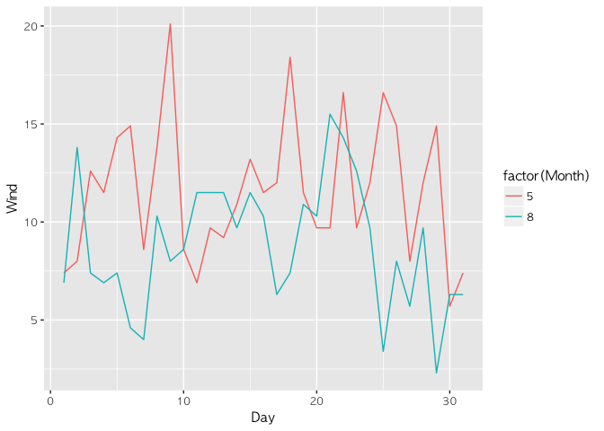

좀 더 효과를 극대화 하기 위해 점 그래프를 함께 붙여도 좋을 것이다.

``` r
airquality2 %>% 
  filter(Month %in% c(5, 8)) %>% 
  ggplot(aes(Day, Wind, color = factor(Month))) +
  geom_line() + geom_point()
```


#### 연습 문제

1.  3~5월까지의 오존을 선그래프로 표현하시오. 각 월별로 구분되는 색깔을 가지게 표현하시오.
2.  1년 전체의 온도를 나타난 선그래프를 표현하시오.

마치며
------

이제 ggplot2 패키지를 활용한 대부분의 그래프 역시 모두 그려봤다. 점, 막대, 선 외에도 다양한 그래프가 있고, 그래프를 조정하는 다양한 옵션(scale\_x\_continuous, labs 등)이 있다. 이것들은 2학기의 <최신사회분석기법과 실습>에서 좀 더 상세하게 배울 예정이다.

### 마지막 단원 안내

마지막 단원에서는 추론통계 분석을 다룬다.
